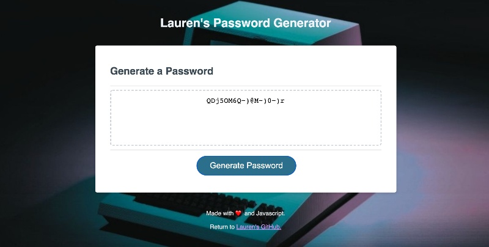

# password-generator
Simple Javascript Password Generator

#### Jump to: 
* [Description](#description)
* [Link](#link)
* [Methods](#methods)
* [Code](#code)
* [Author](#author)


## Description

This site will generate a random password, customized for you! Choose your ideal password length and which types of characters you would like to include. The password generation is done in object-oriented Javascript. 


## Link

[Live Password Generator](https://laurendarrimon.github.io/password-generator/)


## Built With

* [Javascript](https://www.w3schools.com/js/)
* [HTML](https://www.w3schools.com/html/default.asp)
* [CSS](https://www.w3schools.com/w3css/defaulT.asp)


## Methods 

### Javascript
Javascript is used to prompt the user for the ideal length of the password and for the user to confirm which character types are to be included in the the final password. From those inputs, an array of all possible characters is formed. Random number generation selected characters by index from that array. The characters selected by the random index are then joined into one password. That password is written to a window alert and to the text box on the screen. 

<br><br>



<br><br>

### Object-Oriented Javascript
Early versions of this password generator utilized one long password generation function. In subsequent code refactorings, the password generation was broken up into smaller modular functions: 

 - getting the length from the user
 - prompting the user for character sets
 - generating the password array from random index positions
 - joining the array into a new string 

In another refactor, the entire process of generating a password was transitioned into one object, with the above functions converted into multiple object methods that, taken together, will generate a password. This password generation object of key and value pairs is a more structured and modern way of utilizing information and methods. 

<br>
<br>

## Code

### Nested Object Methods:
The process of generating a password is built from linking together various other methods contained within the same self-referencing object, using the keyword "this." 


```
let passwordGenerationObject = {
    ...
    generatePassword: function() {
        length = this.getLength();
        allPossibleCharacters = this.promptUser();
        passwordArray = this.makePasswordArray();
        password = this.joinPassword();
        return this.password;
    },
    ...
}
```


### Randomly Generated Characters:

This object method is a loop that iterates once for each character in the password. For each character needed, it generates a random number between 0 and the number of all possible characters. From that array of possibilities, it draws a character at the indexed position of the random number, and adds that chosen character to the password array. 

```
    ...
    makePasswordArray: function() { 
        for (let i=0; i < this.length; i++) {
            let randomIndex  = Math.floor(Math.random() * (this.allPossibleCharacters.length));
            this.passwordArray.push(this.allPossibleCharacters[randomIndex]);
        }
    return this.passwordArray;
    },
    ...
```


## Author

### Lauren Duker Darrimon 

- [Link to Portfolio Site](https://www.laurenlalita.com)
- [Link to Github](https://github.com/LaurenDarrimon)
- [Link to LinkedIn](https://www.linkedin.com/in/lauren-lalita-duker-9537b1201/)


